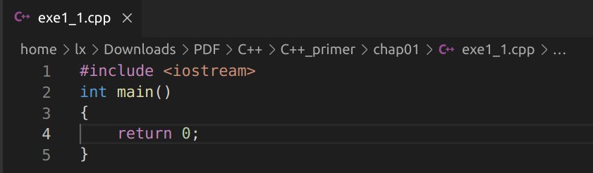
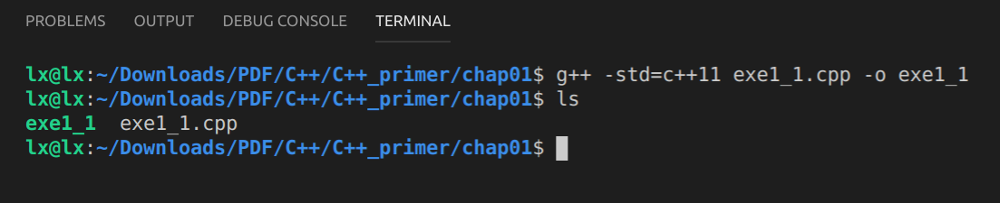
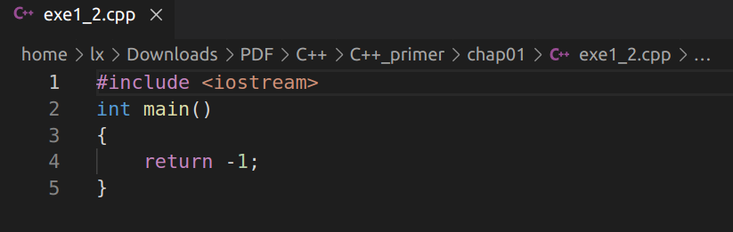
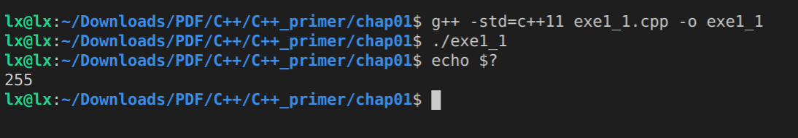
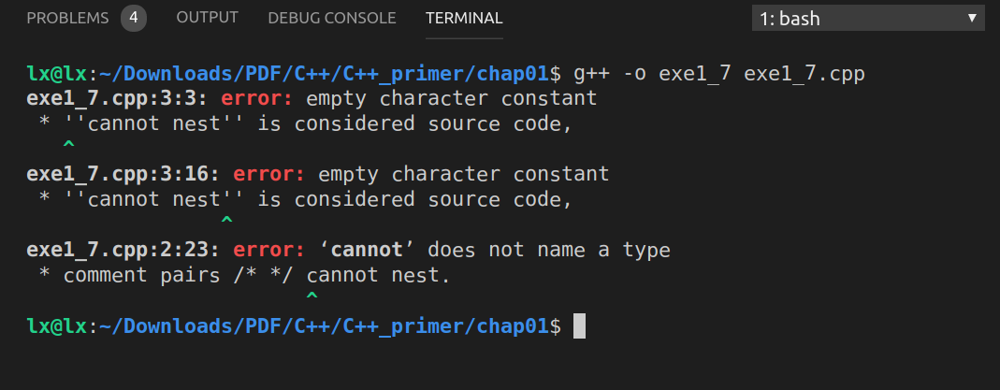
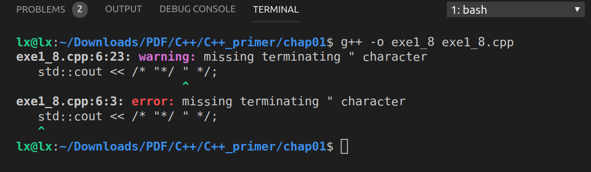

# 第一章 开始

> 练习1.1： 查阅你使用的编译器文档，确定它所使用的文件命名约定。编译并运行第2页的main程序。

GNU : Operating System.

GCC : the GNU Compiler Collection, is a collection of compilers for programming such as C++, C, Objective-C, Java and Fortran.

G++ : mainly design for compiling C++ programming language. 

C++ source files conventionally use one of the suffixes `.C`, `.cc`, `.cpp`, `.CPP`, `.c++`, `.cp` or `.cxx`; C++ header files often use `.hh`, `.hpp`, `H`, or (for shared template code) `.tcc`; and preprocessed C++ files use the suffix `.ii` . GCC recognizes files with these names and compiles them as C++ programs even if you call the compiler the same way as for compiling C programs (usually with the name `gcc`).

[GNU官网](https://gcc.gnu.org/onlinedocs/gcc/index.html#SEC_Contents)

[compile opencv examples using g++](https://stackoverflow.com/questions/9094941/compiling-opencv-in-c)

- code



- compile result



> 练习1.2：改写程序，让它返回-1。返回值-1通常被当做程序错误的标识。重新编译并运行你的程序，观察你的系统如何处理main返回的错误标识。

- code



- result



[Exit codes with Special Meanings](http://www.tldp.org/LDP/abs/html/exitcodes.html)

> 练习1.3： 编写程序，在标准输出上打印`Hello，World`。

```C++
#include <iostream>
int main()
{
    std::cout << "Hello, World" << std::endl;
    return 0;
}
```

> 练习1.4：我们的程序使用加法+运算符来将两个数相加，编写程序使用乘法运算符*，来打印两个数的积。

```C++
#include <iostream>
int main()
{
    std::cout << "Enter two numbers:" << std::endl;
    int v1 = 0;
    int v2 = 0;
    std::cin >> v1 >> v2;
    std::cout << "The product of " << v1 << " and " << v1 << " is " << v1 * v2 << std::endl;
    return 0;
}
```

> 练习1.5： 我们将所有输出操作放在一条很长的语句中。重写程序，将每个运算对象的打印操作放在一条独立的语句中。

```C++
#include <iostream>
int main()
{
    std::cout << "Enter two numbers:" << std::endl;
    int v1 = 0;
    int v2 = 0;
    std::cin >> v1 >> v2;
    std::cout << "The product of ";
	std::cout << v1;
	std::cout << " and ";
	std::cout << v2;
	std::cout << " is ";
	std::cout << v1 * v2;
	std::cout << std::endl;
    return 0;
}
```

> 练习1.6： 解释下面程序片段是否合法。
>
> ```C++
> std::cout << "The sum of " << v1;
>           << " and " << v2;
> 		  << " is " << v1 + v2 << std::endl;
> ```
>
> 如果程序是合法的，它输出什么？如果程序不合法，原因何在？应该如何修正？

不合法，操作符`<<`需要两个操作数，左侧操作数为`ostream`数据类型。修正如下：

```C++
std::cout << "The sum of " << v1;
std::cout << " and " << v2;
std::cout << " is " << v1 + v2 << std::endl;
```

> 练习1.7： 编写一个包含不正确的嵌套注释的程序，观察编译器返回的错误信息。

- code

```C++
/*
* comment pairs /* */ cannot nest.
* ''cannot nest'' is considered source code,
* as is the rest of the program
*/
int main()
{
  return 0;
}

```

- result



>练习1.8： 指出下列哪些输出语句是合法的（如果有的话）：
>
>```c++
>std::cout << "/*";
>std::cout << "*/";
>std::cout << /* "*/" */;
>std::cout << /* "*/" /* "/*" */;
>```
>
>预测编译这些语句将会产生什么样的结果，实际编译这些语句来验证你的答案（编写一个小程序，每次将上述一条语句作为其主体），改正每个编译错误。

1、2 、4均为合法的， 3是不合法的。

- code

```C++

{
  std::cout << "/*";
  std::cout << "*/";
  std::cout << /* "*/ " */;
  std::cout << /* "*/ " /* " /*" */;
  return 0;
}
```

- result



- 修改如下：

```C++
std::cout << /* "*/" */";
```

>练习1.9：编写程序，使用`while`循环将50到100的整数相加。

```C++
#include <iostream>
int main()
{
    int value = 50;
    int sum = 0;
    while(value <= 100)
    {
        sum += value;
        ++value;
    }
    std::cout << "The sum of 50 to 100 is " << sum << std::endl;
    return 0;
}
```

> 练习1.10：除了`++`运算符将运算对象的值增加1之外，还有一个递减运算符（--）实现将数值减一。编写程序，使用递减运算符在循环中按照递减顺序打印出10到0之间的整数。

```C++
#include <iostream>
int main()
{
    int value = 10;
    while (value >= 0)
    {
        std::cout << value << std::endl;
        --value;
    }
    return 0;
}
```

> 练习1.11：编写程序，提示用户输入两个整数，打印出这两个整数所指定的范围内的所有整数。

```C++
#include <iostream>
int main()
{
    int value1 = 5;
    int value2 = 3;
    if (value1 > value2)
    {
        int temp = value1;
        value1 = value2;
        value2 = temp;
    }

    while (value1 <= value2)
    {
        std::cout << value1 << std::endl;
        ++value1;
    }
    return 0;
}
```

>练习1.12：下面的`for`循环完成了什么功能？sum的最终值是多少？
>
>```C++
>int sum = 0;
>for(int i = -100; i <= 100; ++i)
>    sum += i;
>```

功能：计算从-100到100的和。

sum最终值为0。

>练习1.13：使用`for`循环重做1.4.1节中所有练习。

```C++
// 练习1.9
#include <iostream>

int main()
{
    int sum = 0;
    for (int i = 50; i <= 100; ++i)
    {
        sum += i;
    }
    std::cout << "The sum of 50 to 100 is " << sum << std::endl;
    return 0;
}

```

```C++
// 练习1.10
#include <iostream>

int main()
{
    for (int i = 10; i >= 0; --i)
    {
        std::cout << i << std::endl;
    }
    return 0;
}

```

```C++
// 练习1.11
#include <iostream>
int main()
{
    int value1 = 3;
    int value2 = 1;
    if (value1 > value2)
    {
        int temp = value1;
        value1 = value2;
        value2 = temp;
    }
    for (int i = value1; i <= value2; ++i)
    {
        std::cout << i << std::endl;
    }
    return 0;
}
```

> 练习1.14：对比`for`循环和`while`循环，两种形式的优缺点各是什么？

略。

> 练习1.15：编译程序，包含第14页”再探编译“中讨论的常见错误。熟悉编译器生成的错误信息。

略。

> 练习1.16：编写程序，从`cin`读取一组数，输出其和。

```C++
#include <iostream>
int main()
{
    int sum = 0;
    int value = 0;
    while(std::cin >> value)
    {
        sum += value;
    }
    std::cout << "The sum is " << sum << std::endl;
    return 0;
}
```

> 练习1.17：如果输入的所有只都是相等的，本节的程序会输出什么？如果没有重复值，输出又会是怎样的？

略。

> 练习1.18：编译并运行本节的程序，给它输入全部相等的值。再次运行程序，输入没有重复的值。

略。

> 练习1.19：修改你为1.4.1节练习1.10（第11页）所编写的程序（打印一个范围内的数），使其能处理用户输入的第一个数比第二个数小的情况。

```C++
#include <iostream>
int main()
{
    int value1 = 5;
    int value2 = 3;
    if (value1 > value2)
    {
        int temp = value1;
        value1 = value2;
        value2 = temp;
    }

    while (value1 <= value2)
    {
        std::cout << value1 << std::endl;
        ++value1;
    }
    return 0;
}
```

> 练习1.20：在[网站](http://www.informit.com/title/0321714113)上，第一章的代码目录中包含了头文件Sales_item.h。将它拷贝到你自己的工作目录中，用它编写一个程序，读取一组书籍销售记录，将每条记录打印到标准输出上。

```C++
#include "Sales_item.h"
#include <iostream>

int main()
{
    Sales_item item;
    while(std::cin >> item)
    {
        std::cout << item << std::endl;
    }
    return 0;
}
```

>练习1.21：编写程序，读取两个ISBN相同的Sales_item对象，输出他们的和。

```C++
#include "Sales_item.h"
#include <iostream>

int main()
{
    Sales_item item1;
    Sales_item item2;
    std::cin >> item1 >> item2;
    std::cout << "The sum of item1 and item2 is " << item1 + item2 << std::endl;
    return 0;
}
```

> 练习1.22：编写程序，读取多个具有相同ISBN的销售记录，输出所有记录的和。

```C++
#include "Sales_item.h"
#include <iostream>

int main()
{
    Sales_item item;
    Sales_item sum;
    if(std::cin >> item)
    {
        sum = item;
        while(std::cin >> item)
        {
            sum += item;
        }
    }
    std::cout << "The sum of items is " << sum << std::endl;
    return 0;
}
```

> 练习1.23：编写程序，读取多条销售记录，并统计每个ISBN（每本书有几条销售记录）。

```C++
#include "Sales_item.h"
#include <iostream>

int main()
{
    Sales_item currentItem;
    Sales_item item;
    if (std::cin >> currentItem)
    {
        int count = 1;
        while (std::cin >> item)
        {
            if (item.isbn() == currentItem.isbn())
            {
                ++count;
            }
            else
            {
                std::cout << currentItem << " occurs " << count << " times." << std::endl;
                currentItem = item;
                count = 1;
            }
        }
        std::cout << currentItem << " occurs " << count << " times." << std::endl;
    }
    return 0;
}
```

> 练习1.24：输入表示多个ISBN的多条销售记录来测试上一个程序，每个ISBN的记录应该聚在一起。

略。

>练习1.25：借助网站上的Sales_item.h头文件，编译并运行本节给出的书店程序。

略。